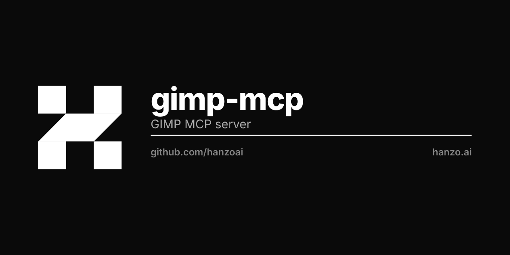

<p align="center"></p>

# hanzo-gimp-mcp

A **clean-room, BSD-3-licensed** bridge that lets external tools drive
[GIMP](https://www.gimp.org/) 3.0 programmatically.

It ships one GIMP 3.0 Python plug-in, `hanzo_gimp_bridge.py`, which registers
itself in GIMP and runs a small **JSON-over-TCP server** inside the running
GIMP process. Clients connect to that socket and invoke GIMP through its
documented **Procedural Database (PDB)** and `Gimp.*` GObject-Introspection
API.

* Protocol: see [`PROTOCOL.md`](./PROTOCOL.md).
* The Hanzo MCP `gimp` tool (TypeScript) and `hanzo-tools-gimp` (Python)
  connect to this bridge and speak the same protocol.

## Clean-room / licensing

This implementation is an **original, clean-room rewrite**. It was designed
solely from GIMP's own public API documentation (the PDB and the GIMP 3.0
Python/GI bindings). It has **no GPL lineage** and reuses no code from any
prior GPL GIMP-MCP implementation.

* License: **BSD-3-Clause** (see [`LICENSE`](./LICENSE)).
* Copyright (c) 2026 Hanzo AI.
* See [`NOTICE`](./NOTICE).

GIMP itself remains GPL and is a separate program; this bridge merely talks to
it over a socket using its public, documented interfaces — the same way any
external automation client would.

## Install

GIMP 3.0 loads Python plug-ins from per-user plug-in directories. Each plug-in
must live in **its own folder whose name matches the script**, and the script
must be **executable**.

### Linux

```sh
mkdir -p ~/.config/GIMP/3.0/plug-ins/hanzo_gimp_bridge
cp hanzo_gimp_bridge.py ~/.config/GIMP/3.0/plug-ins/hanzo_gimp_bridge/
chmod +x ~/.config/GIMP/3.0/plug-ins/hanzo_gimp_bridge/hanzo_gimp_bridge.py
```

### macOS

```sh
mkdir -p "~/Library/Application Support/GIMP/3.0/plug-ins/hanzo_gimp_bridge"
cp hanzo_gimp_bridge.py "~/Library/Application Support/GIMP/3.0/plug-ins/hanzo_gimp_bridge/"
chmod +x "~/Library/Application Support/GIMP/3.0/plug-ins/hanzo_gimp_bridge/hanzo_gimp_bridge.py"
```

### Windows

Copy `hanzo_gimp_bridge.py` into:

```
%APPDATA%\GIMP\3.0\plug-ins\hanzo_gimp_bridge\hanzo_gimp_bridge.py
```

You can also confirm/extend the search paths in GIMP under
**Edit -> Preferences -> Folders -> Plug-ins**.

## Run

1. Start GIMP 3.0. (Optionally set the port first:
   `HANZO_GIMP_PORT=9876 gimp`. `HANZO_GIMP_HOST` defaults to `127.0.0.1`.)
2. In GIMP, run **Filters -> Hanzo -> Start Hanzo Bridge**. GIMP shows a
   message like `Hanzo GIMP bridge listening on 127.0.0.1:9876`.
3. The bridge now accepts JSON-line requests on that port.

A headless variant is possible with GIMP's batch mode; the simplest reliable
setup is an interactive GIMP session with the bridge started from the menu.

## Quick test

With the bridge running, from any shell:

```sh
printf '{"id":1,"method":"version"}\n' | nc 127.0.0.1 9876
```

You should get back a `version` result.

## Connecting from Hanzo

* **TypeScript MCP**: the `gimp` tool in `hanzo/mcp`
  (`src/tools/gimp.ts`) exposes actions
  (`version`, `open`, `export`, `pdb_call`, `new_image`, `image_info`,
  `list_procedures`, `flatten`) and forwards them to this bridge.
* **Python**: `hanzo-tools-gimp` provides `GimpTool` with the same action
  surface.

Both default to `127.0.0.1:9876` and accept `host` / `port` overrides.

## Methods at a glance

`version`, `pdb_call`, `open_image`, `export`, `new_image`, `image_info`,
`list_procedures`, `flatten`. `pdb_call` is the generic escape hatch: it can
invoke **any** PDB procedure, so anything GIMP can do is reachable. See
[`PROTOCOL.md`](./PROTOCOL.md) for full details and examples.
